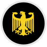

# Bundestag Dashboard

The Bundestag Dashboard is a web app developed as a hands-on coding project for learning purposes. It offers detailed information on German Bundestag members and parties, utilizing the official Bundestag API. Perfect for learning programming while exploring German politics.

## Tech Stack

**Client:** Next.js, React, Typescript, TailwindCSS

**Server:** Node

## Authors

- [@m-kuehnle](https://www.github.com/m-kuehnle)
- [@Leo17220310](https://www.github.com/Leo17220310)

## Run Locally

Clone the project

```bash
  git clone https://github.com/m-kuehnle/bundestag
```

Go to the project directory

```bash
  cd bundestag
```

Install dependencies

```bash
  npm install
```

Start the development server

```bash
  npm run dev
```

